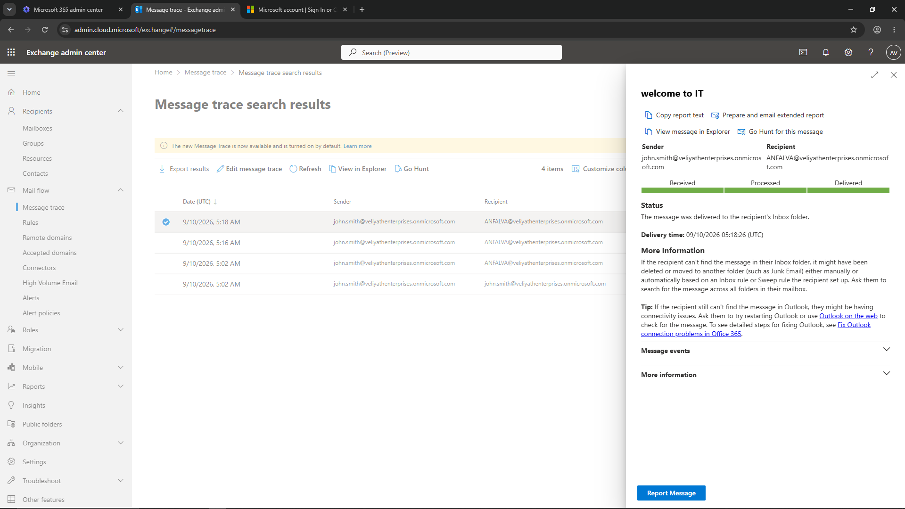
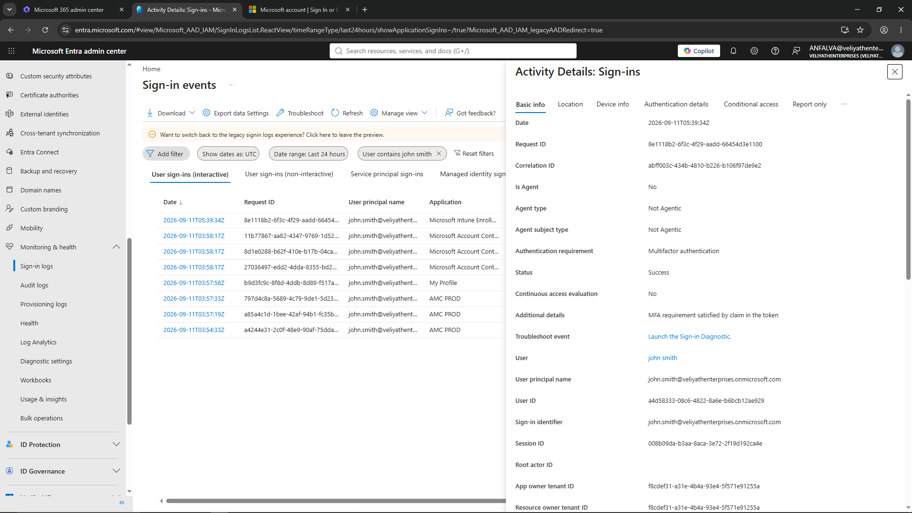
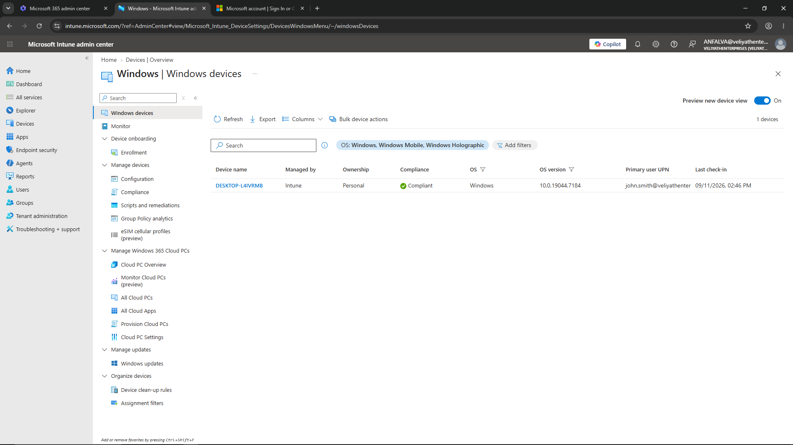
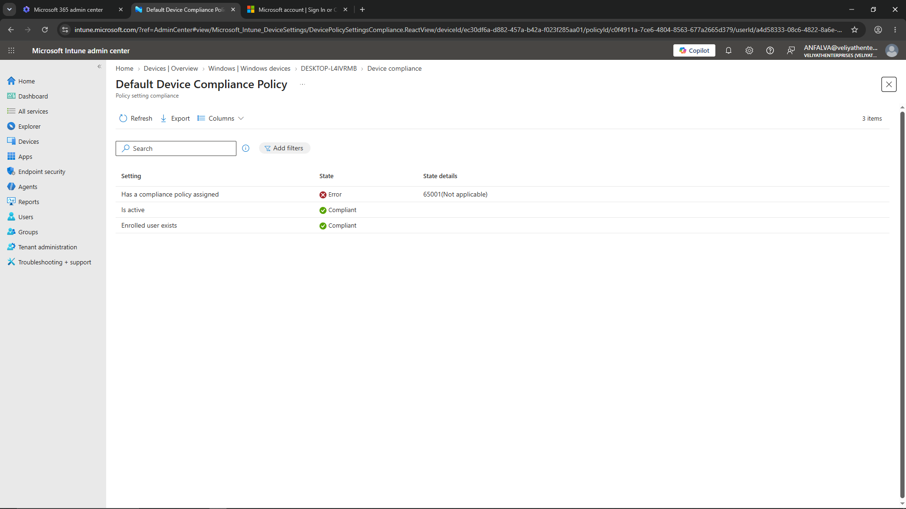
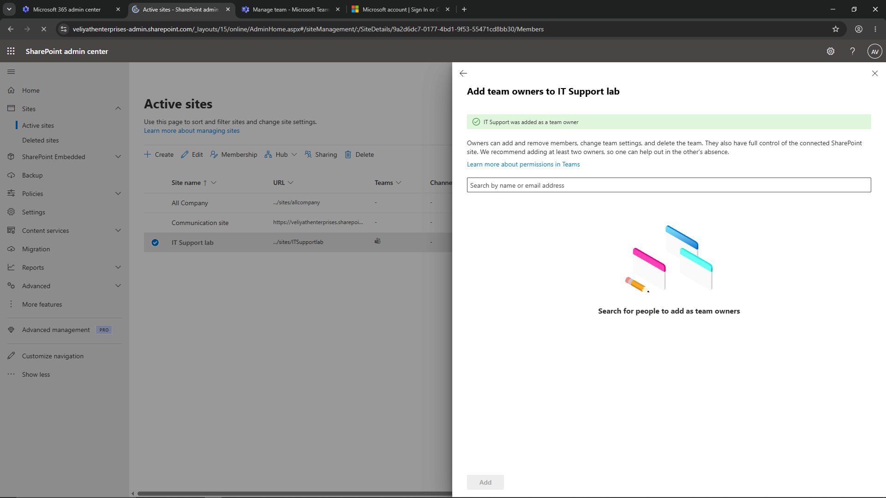

# Microsoft 365 Administration & IT Support Lab

A hands-on Microsoft 365 Business Premium lab built to practice common L1 IT Support and Microsoft 365 administration tasks in a small business-style environment.

## Overview

I set up a Microsoft 365 environment with test users and worked through common support and administration scenarios involving user accounts, email, authentication, devices, and collaboration tools.

The main focus was understanding where to check when a user or device has an issue and practicing the basic administrative actions used to resolve or investigate it.

## Environment

- Microsoft 365 Business Premium
- Microsoft Entra ID
- Microsoft Intune
- Exchange Online
- Microsoft Teams
- SharePoint
- Windows 10 Enterprise

## Tasks Performed

### Microsoft 365 Admin Center

Created and managed test user accounts, practiced password resets, reviewed Microsoft 365 licenses and services, and worked with shared mailboxes.

### Exchange Online

Used Message Trace to check the delivery of a test email and reviewed the message events and delivery status. Also configured Full Access mailbox permissions for an IT Support account.

### Microsoft Entra ID

Reviewed user accounts and sign-in activity, registered Microsoft Authenticator for MFA, and created and tested a Conditional Access policy requiring MFA for a test user.

### Microsoft Intune

Configured automatic Windows enrollment and enrolled a Windows PC into Intune. Reviewed the device's compliance status, investigated a compliance result, performed a manual device sync, configured a Microsoft 365 Apps deployment, and checked for the availability of a BitLocker recovery key.

### Microsoft Teams

Created a private Team and added a test user as a member to practice managing access to a private Team.

### SharePoint

Managed the site's membership and added the IT Support account as a Team owner.

## L1 Troubleshooting Scenarios Practiced

The lab included basic troubleshooting scenarios involving user access, passwords, MFA, sign-in activity, email delivery, mailbox permissions, Windows device enrollment, device compliance, application deployment, and Teams/SharePoint access.

## Key Learning

The lab helped me understand how the main Microsoft 365 services work together and where an L1 technician would typically investigate an issue.

| Service | Main Use |
|---|---|
| Microsoft Entra ID | User identity, sign-in and access |
| Microsoft Intune | Device and application management |
| Exchange Online | Email and mailbox management |
| Microsoft Teams | Team communication and collaboration |
| SharePoint | Sites and file collaboration |

## Screenshots

### Exchange Online — Message Trace

### Microsoft Entra ID — MFA Sign-in

### Microsoft Intune — Device Management

### Microsoft Intune — Device Compliance

### SharePoint — Team Ownership

